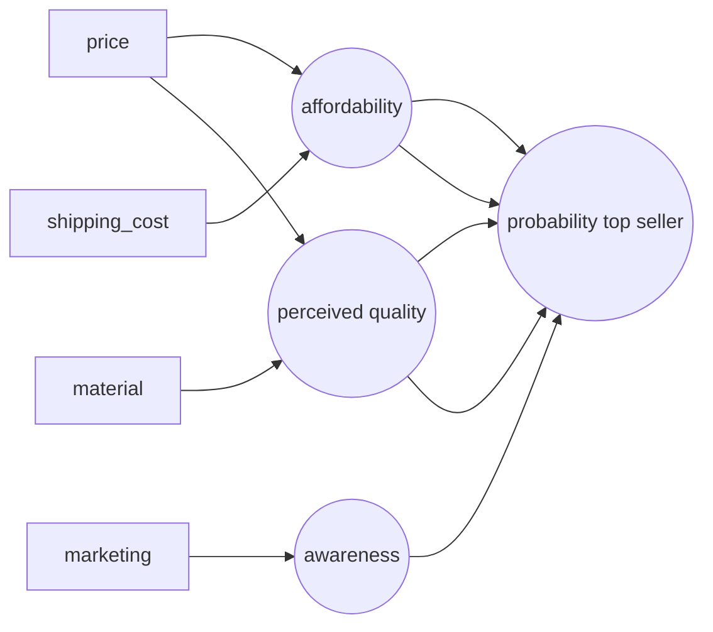

# Week1
## Neural networks intuition
### Neurons and the brain
- Neural networks
  - Origins: algorithms that try to mimic the brain, started in 80's and 90's
  - Resurgence around 2005 Also referred to as "deep learning", but more of a branding thing
  - application history: speech -> images -> text (NLP) -> ...
- Neurons in the brain
  - number of inputs, does computation based on them, then sends outputs to other neurons
- Artificial neural network uses simplified mathematical model of a biological neuron
- Andrew Ng believes that we today have no idea how the brain actually works
  - So don't take the biological motivation too seriously
- neural networks provide a better performance when fed with large amounts of data compared to "traditional AI"
### Demand predication (example)
- Predict if a t-shirt becomes a top seller
  - logistic regression with sigmoid function
  - input: $x$ = price
  - output: $a = f(x) = \dfrac{1}{1+e^{-(wx+b)}}$
    - setting this up for a neural network, the output is denoted as $a$ which stands for activation
    - activation is a term from neuroscience, describing how much a neuron is sending a high output to other neurons
  - the logistic expression can be thought of as a single neuron
    - input price $x$ is computed to $a$, the probability of the shirt being a top seller
- More complex version with more input parameters:

- affordability, awareness, and perceived_quality are each a logistic regression unit or a neuron
  - they are also called "activations"
- grouping them together into a layer aka a grouping of neurons
  - in this example it is a "hidden layer"
- neuron on the right is a layer of one, also called "output layer"
- price, shipping cost, marketing, material also called "input layer"
- assigning inputs to neurons is an effort and not possible to do "by hand" in a large model
  - in practice, each neuron in a certain layer has access to the inputs from the previous layer
- Reducing vector size
  - "input layer" has 4 numbers
  - "hidden layer" has 3 numbers
  - "output layer" has 1 number
- It is logistic regression at its core, but it uses a different - hopefully more accurate - set of features ( the hidden layer )
  - version of logistic regression that can learn his own features that makes it easier to make accurate predications vs. "manual feature engineering"
- Neural network identifies which inputs should be combined
- Multiple hidden layers
  - multiple hidden layers with different numbers of neurons
  - questions how many layers should be included is a neural network architecture decision
  - sometimes referred to as "multi layer perceptron"
### Example: recognizing images
- 1000 x 1000 pixel image of a face, each cell has a brightness value between 0-255
- Problem statement: can you take an input vector with a million (brightness) numbers and output a persons identity?
- First hidden layer might look for small structures such as lines and edges (very small window)
- Second layer might combine these and look for parts of faces (bigger window)
- Third hidden layer might attempt to aggregate different parts of a face, looking for a face shape (even bigger window)
- Output layer might attempt to map this to an identity
- Remarkable point: no one ever told the neural network to look for the patterns
## Neural networks layer
- labeling of layers in a neural network from 0,1,2...
- adding the layer as superscript in square brackets: $\overrightarrow{w}_2^{[1]},b_2^{[1]}$
  - $w$ and $b$ for the second neuron in layer 1 in a neural network
- each layer takes vector of numbers as input and outputs another vector of numbers
### More complex neural networks
- $\overrightarrow{w}_2^{[3]},b_2^{[3]}$ is input for $a_{2}^{[3]}=g(\overrightarrow{w}_2^{[3]}\cdot\overrightarrow{a}^{[2]}+b_2^{[3]})$
  - In this example, we calculate the activation result for the second neuron in the third layer
- General formula:
  - $a_{j}^{[l]}=g(\overrightarrow{w}_j^{[l]}\cdot\overrightarrow{a}^{[l-1]}+b_j^{[l]})$
  - Activation value of layer $l$, unit(neuron) $j$
  - Parameters $w$ and $b$ of layer $l$, unit $j$
  - $g$ is the sigmoid function, but in the context of neural networks, it is also called the "activation function"
  - input function $\overrightarrow{x}$ can be referred to as
### Inference: making predictions (forward propagation)
  - 8 by 8 image to identify handwritten numbers 0 or 1
  - 255 white pixel, 0 black pixel and brightness shades in between
  - Neural network design
    - 2 hidden layers, layer 1 has 25 units, layer 2 has 15 units, layer 3 has 1 unit (output layer)
    - output unit provides probability of being a handwritten '1'
  - since the algorithm "goes from left to right" it is also called forward propagation
## TensorFlow implementation
### Inference in code
  - coffee roasting example with duration (minutes) and temperature (celsius) as input and $0$ and $1$ as output for "good coffee"
  - ```x = np.array([[200.0, 17.0]])```
    - input array of two numbers, e.g. 200 degree Celsius and 17 minutes
  - ```layer_1 = Dense(units=3, activation='sigmoid')```
    - first hidden layer of neural network, three units aka "neurons" and sigmoid as the activation function, Dense is the layer type
  - ```a1 = layer_1(x)```
    - As an example, might output [0.2 0.7 0.8]
  - ``` layer_2 = Dense(units=1, activation='sigmoid')```
    - output function
  - ```a2 = layer_2(a1)```
    - As an example, might output [0.8]
### Data in TensorFlow
  - ```np.array([200, 17])``` [200 17] 1x2 matrix -> also called row vector
  - ```np.array([[200],[17]])``` $\begin{bmatrix} 200 \\ 17 \end{bmatrix}$  2x1 matrix -> also called column vector
  - convention in TensorFlow is to use these 2D matrices for data instead of 1D "regular" vectors
  - possible to call ```.numpy()``` on a TensorFlow tensor to get the numpy array equivalent, e.g. ```a1.numpy()```
### Building a neural network
  - Tensorflow allows to string different layers and pass data through automatically via "Sequential" framework
  - ```model=Sequential([layer_1, layer_2])```
    - Followed by three steps:
    - ```model.compile(...)```
    - ```model.fit(x,y)```
    - ```model.predict(x_new)```
## Speculations on artificial general intelligence (AGI)
  - AI includes
    - ANI (artificial narrow intelligence), e.g. smart speaker, self-driving, web search etc.
    - AGI (artificial general intelligence), do anything a human can do 
  - Currently AI "neural networks" are so much simpler than an actual brain
  - Mankind still has (almost) no idea how the human brain works
  - The "one learning algorithm" hypothesis 
    - The Auditory cortex in the brain - which processes audio - can "learn to see" if fed with images [Roe et al., 1992]
    - The Somatosensory cortex - which is responsible for processing touch sensations - can "learn to see" if fed with images [Metin & Frost, 1989]
    - hypothesis: maybe there is on tissue/algorithm in the brain that can learn anything based on the input it is given
      - What would this algorithm be?
  - Currently a lot of "hype" stating that we get (significantly) closer to AGI, whereas most progression is in the field of ANI
## Vectorization - How neural networks are implemented efficiently
- NumPy offers "matmul" function for matrix multiplication
# Week2
## Neural Network Training
### TensorFlow implementation
- Train a Neural Network in Tensorflow: i) define model, ii) compile model while specifying the loss function, iii) fit the model, defining epochs aka number of steps in gradient descent
### Training details
- Recap, model training steps:
  1. specify how to compute output given input x and parameters $w,b$ (aka define model): $f_{\overrightarrow{w},b}(\overrightarrow{x})$ = ?
  2. specify loss and cost function: $L(f_{\overrightarrow{w},b}(\overrightarrow{x}),y)$
  3. train on data to minimize cost function $J(\overrightarrow{w},b)$
## Activation Functions
### Alternatives to the sigmoid activation
- Sigmoid function used so far for outputting binary result
- ReLU - rectified linear unit - returns $z$ if $z$ is greater than or equal to 0, so the output grows linearly with $z$
  - $g(z) = max(0,z)$
- Most commonly used activation function:
  - Linear activation function: $g(z)=z$
    - Sometimes people argue here that "no activation function is being used"
  - Sigmoid: $g(z)=\dfrac{1}{1+{e}^{-z}}$
  - ReLU: $g(z) = max(0,z)$
### Choosing activation functions
  - For output layer
    - Binary classification -> use Sigmoid
    - Regression, problem where $y$ can be positive or negative value -> use Linear activation function
    - Regression, problem where $y$ can only take positive values -> use ReLU
  - For hidden layer
    - most common choice is ReLU
    - it is faster to compute than Sigmoid
    - ReLU only "goes flat" in one part of the graph, aka left side
      - faster learning since better for linear regression
### Why do we need activation functions?
- If no activation function would be used, there is no benefit of utilizing a neural network aka it boils back down to linear regression
  - Not able to fit anything more complex than linear regression model without activation function
- A linear function of a linear function is itself a linear function
- That's why no linear activation function should be used in the hidden layers of a neural network as well
## Multiclass Classification
- Target $y$ can take on more than two possible values
### Softmax
- Softmax regression algorithm is a generalization of logistic regression which is a binary classification algorithm to the multiclass classification contexts
- Let's assume a Softmax regression has 4 possible outputs, $y=1,2,3,4$
- Softmax calculates likelihood for every possible outcome with varying $\overrightarrow{w},b$ in $z=\overrightarrow{w}*\overrightarrow{x}+b$
  - The sum of all likelihoods is 1.
- Softmax with 2 possible outputs gives results similar to logistic regression
### Neural Network with Softmax output
- Output layer will be a Softmax output layer
  - Example: 10 units/10 classes for a neural network that detects hand-written numbers 0...9
### Improved implementation of Softmax
- Numerical Roundoff Errors
  - option 1: $x=\dfrac{2}{10000}$
  - option 2: $x=(1+\dfrac{1}{10000})-(1-\dfrac{1}{10000})$
  - In jupyter (python), option 1 evaluates to $0.0020000000000000000$, option 2 to $0.001999999999999978$ due to floating point precision
- Tensorflow allow with "from_logits=True" option during the compile step to skip the materialization of intermediate values between layers, resulting in a numerically more accurate implementation of logistic loss, alongside with using "linear" in the output layer instead of "softmax"
### Classification with multiple outputs (multi-label vs multi-class)
- Multi-label classification: target of Y is actually a vector of three numbers (e.g. $\begin{bmatrix} 1 \\ 0 \\ 1 \end{bmatrix}$) which is different from multi-class classification where Y is just a single number with 10 different possible values
- Neural network design: instead of building three separate neural networks which each put out one value, train one neural network with three outputs
## Additional Neural Network Concepts
### Advanced Optimization
- "Adam algorithm" (Adaptive Moment estimation)
  - sees that learning rate $\alpha$ is too small, increases it to conclude at the minimum faster
  - can also make $\alpha$ smaller if results are oscillating back and forth
  - does not use a single $\alpha$, but uses a separate $\alpha$ for each $w$ and an additional one for parameter $b$
- In Tensorflow, provide optimizer parameter (tf.keras.optimizers.Adam) to the compiler
### Additional Layer Types
- Recap:
  - Dense Layer: each neuron output is a function of **all** the activation outputs of the previous layer
- Convolutional Layer
  - Each neuron only looks at part of the previous layer's outputs, resulting in:
    - Faster computation
    - Need less training data aka less prone to overfitting
- Convolutional Neural Network
  - Activation unit in a layer looks only at a selected subset of the outputs from the previous layer
## Back propagation
### What is a derivative?
- Defines the slope of a curve (first derivative -> erste ableitung)
- Notation: If $J(w)$ is a function of one variable $(w)$, the derivate is expressed via: ${\partial}\frac{\mathrm{d}}{\mathrm{d}w}J(w)$
### Computation graph
- A set of nodes connected by edges/arrows, showing the forward prop step and calculation of result
- Given an activation function $a = wx +b$ with a resulting cost function $J(w,b)=\frac{1}{2}(a-y)^2$, how do we find the derivatives of J with respect to $w$ and $b$?
- Forward prop is a "left to right computation"
- Back prop is a "right to left computation", relying on chain rule for calculus
- Helps to answer $\frac{\partial J}{\partial w}$ aka "How much does a change in $w$ affect a change in $J$?"
- Efficiency gains: brings down complexity of computing derivatives from quadratic to linear complexity

# Week3
## Advice for applying machine learning
### Deciding what to try next
- Debugging a learning algorithm
  - Get more training examples
  - Try smaller sets of features
  - Try getting additional features
  - Try adding polynomial features
  - Try decreasing $\lambda$
  - Try increasing $\lambda$
- Which one to pick? - Machine learning diagnostic, gaining insight what works or does not work.
### Evaluating a model
- Split available data 70/30 or 80/20 into training set and test set
- Compute training error to quantify how well your model is doing
- If $J_{train}(\overrightarrow{w},b)$ is low (cost for training data is low), but $J_{test}(\overrightarrow{w},b)$ (cost for test data) is high, the model might be overfitted
### Model selection and training/cross validation/test sets
- Split into three data sets:
  - training set (e.g. 60%)
    - Data used to tune model parameters ${w} and ${b} in training or fitting
  - (cross) validation set or dev set (e.g. 20%)
    - Data used to tune other model parameters like degree of polynomial, regularization or the architecture of a neural network.
  - test set (e.g. 20%)
    - Data used to test the model after tuning to gauge performance on new data
- Parameters for different models are evaluated with validation set
- The cost $J_{cv}(\overrightarrow{w},b)$ for different models are calculated
- The cost of the "winning" model is then evaluated with the test set
## Bias and variance
### Diagnosing bias and variance
- Looking at bias and variance of a learning algorithm is a good indicator what to look at/improve next
- Look at performance on training and cross validation set ("looking" at graphs not practical with many variables)
  - High bias (underfit)
    - $J_{train}$ is high
    - $J_{cv}$ is high
      - $J_{train}$ will be high
      - ( $J_{train}$ equivalent to $J_{cv}$)
  - "Just right"
    - $J_{train}$ is low
    - $J_{cv}$ is low
  - High variance (overfit)
    - $J_{train}$ is low
    - $J_{cv}$ is high
      - $J_{cv}$ >> $J_{train}$
      - $J_{train}$ may be low
  - High bias and high variance (overfit and underfit at the same time, not happening that much)
    - $J_{train}$ will be high
    - $J_{cv}$ >> $J_{train}$
- Find the minimum of $J_{cv}$ over the different degrees of polynomial $d$
### Regularization and bias/variance
- Regularization parameter Lambda $\lambda$ affects bias and variance
- Setting $\lambda=0$ results in no regularization
- With a small $\lambda$, the variance between $J_{cv}$ and $J_{train}$ can be large, with a large $\lambda$ the variance between $J_{cv}$ and $J_{train}$ gets smaller, because $J_{train}$ gets larger.
### Establishing a baseline level of performance
- Benchmarking error rate e.g. with human level performance sets it in context (speech recognition example)
  - Allows to say if training error rate $J_{train}$ is high/low/expected
- Baseline level of performance -> What is the level of error you can reasonable hope to get to?
- What is the error between baseline performance and training error ($J_{train}$)?
  - If the error rate is high -> high variance
- What is the error between training error ($J_{train}$) and cross validation error $J_{cv}$?
  - If the error rate is high -> high bias
### Learning curves
 - Learning curves help to understand how a learning algorithm is doing as a function of the amount of experience it has such as the number of training examples
 - With a larger training set size $m_{train}$, $J_{train}$ increases as there are more and more data points which don't fit perfectly, but $J_{cv}$ decreases as your model gets better
 - If a learning algorithm has high bias, adding more (training) data won't help
 - Overfitting your training data might result in an unrealistically low error rate
  - Signal for high variance is if $J_{cv}$ is much higher than $J_{train}$
  - In this situation, increasing the training set size could help a lot
### Deciding what to try next revisited
- Debugging a learning algorithm
  - Get more training examples -> fixes high variance
  - Try smaller sets of features -> fixes high variance
  - Try getting additional features -> fixes high bias
  - Try adding polynomial features -> fixes high bias
  - Try decreasing $\lambda$ -> fixes high bias
  - Try increasing $\lambda$ -> fixes high variance
- If your algorithm has high variance
  - get more training data
  - simplify your model
- If your algorithm has high bias
  - make your model more powerful / give it more flexibility, e.g. by
  - give it additional features
  - decrease regularization parameter $\lambda$
### Bias/variance and neural networks
- Large neural networks are low bias machines
- Does your NN do well on the training set $J_{train}(\overrightarrow{w},b)$ ?
  - No? -> build a bigger network, e.g. by adding more (hidden) layers
  - Yes -> Does it do well on the cross validation set $J_{cv}(\overrightarrow{w},b)$ ?
    - No? -> Get more data and go back to validate on training set.
    - Yes -> "Done"
- What if the NN becomes "too big", does it create a high variance problem?
  - A large NN will usually do well or better than a smaller one so long as regularization is chosen appropriately.
  - However, might be slower or more costly to operate.
## Machine learning development process
### Iterative loop of ML development
1. Choose architecture (model, data, etc.)
2. Train model
3. Diagnostics (bias, variance and error analysis)
-> repeat loop with additional tweaks such as make your NN bigger, change $\lambda$ parameter, add more data, add/subtract features etc.
### Error analysis
- Analyze examples by hand where the algorithm has misclassfied the data.
- Categorize the misclassfied examples based on common traits
- Count occurrences and prioritize accordingly
- Resulting categories might be overlapping and not mutually exclusive
- Limitation: much easier to do where humans can easily to the task / recognize what is right/expected
### Adding data
- Trying to get more data of all types can be slow and expensive
- Add more data of the types where error analysis has indicated it might help
- Data augmentation: modify an existing training example to create new training example
  - apply distortion or transformation (e.g. mirror image, adjust brightness or adjust background noise to audio clip etc)
  - should be representative of "noise" you might encounter in the test set
- Data synthesis: using artificial data inputs to create a new training example
  - Example: export text as pictures as training data for OCR
- AI = Code + Data
  - Conventional model-centric approach: focus on improving the code/algorithm/model
  - Data-centric approach: spend time on improving the data
 ### Transfer learning: using data from a different task
- Train NN for a similar or superset problem, then apply NN to your problem and your own data, but change output layers and parameters
  - Example: train NN for general image recognition (with 1000 classes), then reuse for recognizing numbers 1,2,3...9
- Parameters for all layers - except output layer - can be reused as starting point
- Option 1: only train output layer parameters
  - aka supervised pre-training
- Option 2: train all parameters in NN
  - fine tuning
- Possible to download pre-trained model from someone else
- Only works in the same domain (e.g. image vs audio recognition)
- GPT-3 as popular example for transfer learning
### Full cycle of a machine learning project
1. Scope project -> Define project
2. Collect data -> Define and collect data
3. Train model -> Training, error analysis & iterative improvement
  - Feedback loop into "Collect data"
4. Deploy in production -> Make available for people to use. Deploy, monitor and maintain system
  - Feedback loop into both "Train model" and "Collect data"
- Deployment
  - Inference server runs ML model, takes requests via API call (e.g. from mobile app) and returns Inference
  - Software engineering needed for:
    - Ensure reliable and efficient predictions
    - Scaling
    - Logging
    - System monitoring
    - Model updates
  - Such tasks can be done by "MLOps" - machine learning operations
### Fairness, bias, and ethics
- Bias
  - Hiring tool discriminates, biased bank loan approvals rejects certain groups
- Adverse use cases
  - Deepfakes
  - Spreading toxic speech for engagement
  - Fake content for commercial/political purposes
  - Spam
- Guidelines
  - Get a diverse team to focus on possible harm to vulnerable groups
  - Literature search on guidelines for industry
  - Audit systems against possible harm prior to deployment
  - Have mitigation plan and after deployment monitor for possible harm
## Skewed datasets
### Error metrics for skewed datasets
- Ratio of positive to negative examples is very skewed, e.g. not 50:50
- Confusion matrix (2x2 matrix or table) for 100 examples

|| Actual Class 1 | Actual Class 0 |
|-| - | - |
|Predicted Class 1| True positive (15) | False positive (5) |
|Predicted Class 0| False negative (10) | True negative (70) |

- Precision (ratio of predicted positives we get right): $\frac{\text{true positives}}{\text{total number of predicated positives}}$ = $\frac{\text{true positives}}{\text{true pos}+\text{false pos}}$ = $\frac{15}{15+5}=0.75$
 - Example: Of all patients where we predicted $y=1$, what fraction actually have the rare disease?
- Recall (ratio of all positive cases we actually detected): $\frac{\text{true positives}}{\text{total number of actual positives}}$ = $\frac{\text{true positives}}{\text{true pos}+\text{false neg}}$ = $\frac{15}{15+10}=0.6$
  - Example: Of all patients that actually have the rare disease, what fraction did we correctly detect having it? How many patients would have you accurately diagnosed?
- Computing precision and recall makes it easier to spot if an algorithm is reasonable accurate.
### Trading off precision and recall
- We want to predict $y=1$ (e.g. rare disease) only if very confident => higher precision, lower recall
- We want to avoid missing too many cases of rare diseases, when in doubt predict $y=1$ => lower precision, higher recall
- E.g. adjust threshold of logistic regression accordingly
- F1 score allows automatically combining precision and recall
  - pays more attention to whichever is lower
- F1 score =  $\frac{1}{\frac{1}{2}(\frac{1}{p}+\frac{1}{r})} = 2 \frac{PR}{P+R}$
  - aka "Harmonic Mean"
# Week4
## Decision trees
### Decision tree model
- Model output by the learning algorithm looks like a (decision) tree
- Node makes one decision regarding a feature at the time
- Leaf nodes represent categories
### Learning process
- First step of decision tree learning is to decide which feature to use at the root node.
- Then decide on second feature etc one traverses down the tree.
- Decision 1:
  - How to choose what feature to split on at each node?
  - Goal is to maximize purity (or minimize impurity)
- Decision 2:
  - When do you stop splitting?
    - When a node is 100% one class
    - When splitting a node will result in the tree exceeding a maximum depth
      - Keeping a tree small helps to prevent overfitting
    - When improvements in purity score are below a certain threshold
    - When number of examples in a node is below a threshold
## Decision tree learning
### Measuring purity
- Entropy function as a measure if impurity $H(p_{1})$
  - When set of examples is 50:50 $H(p_{1}) = 1$
  - When set of examples is 100:0 or 0:100 $H(p_{1}) = 0$
### Choosing a split: Information gain
- In decision tree learning, the reduction of entropy is called information gain
- Numbers of examples in each subbranch matters as well as the entropy itself
- Weighted average is utilized to combine entropies across all branches
- We calculate the reduction of entropy
- Formal definition
  - $p_{1}^{left}$ fraction of examples in the left subtree that have a positive example
  - $w^{left}$ fraction of examples of all examples at the root node that went to the left sub-branch
  - $p_{1}^{right}$ fraction of examples in the right subtree that have a positive example
  - $w^{right}$ fraction of examples of all examples at the root node that went to the right sub-branch
  - $p_{1}^{root}$ fraction of examples that are positive in the root node
  - Information gain = $H(p_{1}^{root})-(w^{left}H(p_{1}^{left})+w^{right}H(p_{1}^{right}))$
### Putting it together
- Apply recursive splitting to build decision tree
### Using one-hot encoding of categorical features
- Instead of one feature which can three values, we have three (new) features which can only be 0 or 1
- If a categorical feature can take on $k$ values, create $k$ binary features (0 or 1 valued).
- Since only one feature takes on the 1, it's call "one hot" encoding
### Continuous valued features
- Consider different values to split on, calculate information gain and use the value with the highest information gain for the split
### Regression Trees
- It is ok to have a decision tree that splits on the same feature in the left and rights subtrees
- When building a regression tree, instead of trying to reduce entropy, we try to reduce the variance
  - We measure the reduction in variance
## Tree ensembles
### Using multiple decision trees
- Trees are highly sensitive to small changes of the data
- More accurate result by not only using one decision tree, but multiples - an ensemble
- Run new test example through multiple trees and let them vote on the result
### Sampling with replacement
- create multiple random training sets which are all slightly different
  - one example can occur in multiple training sets and can occur multiple times in the same set
### Random forest algorithm
- Bagged decision tree
  - Given training set of size $m$
  - For $b=1$ to $B$:
    - Use sampling with replacement to create a new training set of size $m$
    - Train a decision tree on the new dataset
  - Usually $m$ is a number around 64~128
  - Downside: can end up with the same choice of feature at the root node or close to the root
- Random forest
  - Randomizing the feature choice: At each node, when choosing a feature to split, if $n$ features are available, pick a random subset of $k<n$ features and allow the algorithm to only choose from that subset of features.
  - More robust since little changes to the training set are less likely to have a huge impact on the overall output
### XGBoost
- Most commonly used decision tree is XGBoost (eXtreme Gradient Boosting)
  - Main change: instead of picking from all examples with equal probability, make it more likely to pick misclassified examples from previously trained trees
  - More attention on the subset it is doing well on
  - This is the meaning of "boosting"
### When to use decision trees
- Decision trees and tree ensembles
  - works well on tabular/structured data
  - not recommended for unstructured data ( images, audio, text )
  - can be fast to train
  - small decision trees may be human interpretable
- Neural Networks
  - works well on all types of data, including tabular/structured and unstructured data
  - may be slower than a decision tree
  - works with transfer learning
  - might be easier to combine multiple neural networks than combining multiple decision trees
